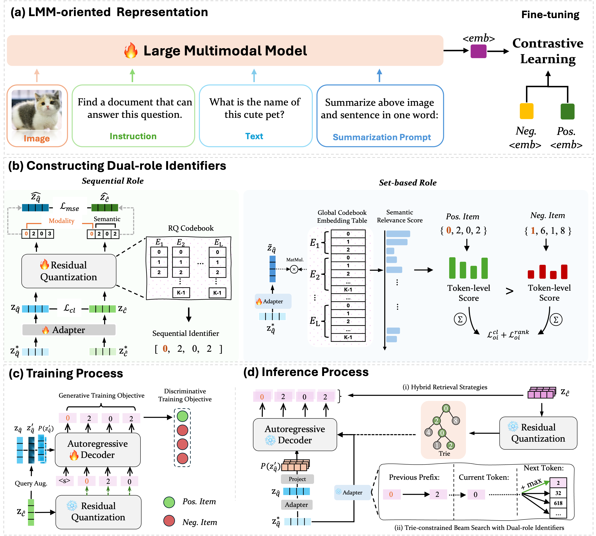
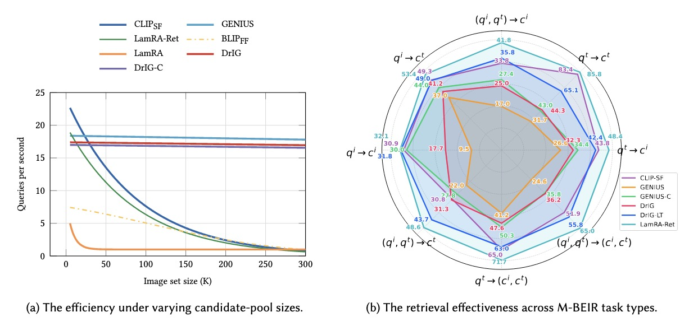

## DrIG

This repo provides the source code and checkpoints for our paper **Generative Universal Multimodal Retrieval with Dual-role Identifiers**.

<div align="center">
   
[](LICENSE)
[](drig_env.yml)
[](drig_env.yml)
[](https://huggingface.co/datasets/TIGER-Lab/M-BEIR)
[](https://huggingface.co/KaiPengLi/DrIG/tree/main/checkpoints)

</div>

## Introduction

We propose **DrIG**, a novel **G**enerative framework for universal multimodal retrieval featuring **D**ual-**r**ole **I**dentifiers, which supports diverse retrieval tasks across multiple modalities and domains.


### ✨ Key Advantages

- **Guided Constrained Decoding**  
  Uses an order-invariant global relevance prior to guide constrained beam search and alleviate local-optimum errors.

- **Effectiveness–Efficiency Trade-off**  
Maintains a balance between retrieval effectiveness and inference efficiency under large-scale candidate pools.

- **Universal Multimodal Retrieval**  
Single model supports diverse retrieval tasks across multiple modalities and domains.

## 🔎 Overview

DrIG follows a three-stage training  pipeline:

**Stage 0: Multimodal Feature Extraction (LamRA-Ret)**  
   Encodes queries and candidates into a shared multimodal embedding space. We leverage **LamRA-Ret** for encoder-side multimodal feature extraction, with pretrained checkpoints available on **[Hugging Face](https://huggingface.co/code-kunkun/LamRA-Ret)**.
   
**Stage 1: Dual-role Identifier Construction**  
   Converts candidate embeddings into modality-aware residual-quantized identifiers. Each candidate is assigned a single identifier and reused in two complementary roles: a **sequential role** for autoregressive generation and a **set-based role** for prefix-independent relevance estimation.


**Stage 2: Generative Retriever Training**  
   Trains the set-based guidance module and T5 decoder for identifier generation. During inference, candidates are retrieved through Trie-constrained beam search with an order-invariant global relevance prior and optional dense top-k reranking.

<p align="center">
  
</p>

<p align="center"><em>Figure 1: An overview of the proposed DrIG framework</em></p>

## ⚙️ Installation

Clone this repository and create the Conda environment:

```bash
git clone https://github.com/ii-research/DrIG.git
cd DrIG
conda env create -f drig_env.yml
conda activate dig
```

The environment uses Python 3.10 and PyTorch 2.5.1. Git LFS is also included for downloading large model and dataset files.

## 📚 Dataset

### M-BEIR

We use [M-BEIR](https://huggingface.co/datasets/TIGER-Lab/M-BEIR), the Multimodal BEnchmark for Instructed Retrieval, for training and evaluating universal multimodal retrieval models.

Install Git LFS and clone the dataset:

```bash
git lfs install
git clone https://huggingface.co/datasets/TIGER-Lab/M-BEIR
```

After downloading, update the dataset paths in the corresponding YAML config files and shell scripts before training or evaluation.

### MSCOCO and Flickr30k

This repository also supports text-to-image retrieval experiments on MSCOCO and Flickr30k.

For Flickr30k, download the original dataset first. One available Kaggle mirror is:

```text
https://www.kaggle.com/datasets/eeshawn/flickr30k
```

Prepare MSCOCO and Flickr30k task0 training data:

```bash
cd src/data
bash preprocessing/coco_flickr/run_flickr_mscoco_task0_pipeline.sh
```

## 🤗 Model Checkpoints

### 🔗 LamRA-Ret

We use LamRA-Ret for encoder-side multimodal feature extraction.

```text
https://huggingface.co/code-kunkun/LamRA-Ret
```

### 📦 DrIG Checkpoints

We provide DrIG checkpoints on Hugging Face:

```text
https://huggingface.co/KaiPengLi/DrIG/tree/main/checkpoints
```

Download the residual quantization checkpoint and the available generative retriever checkpoints:

```bash
mkdir -p checkpoints/DrIG

wget https://huggingface.co/KaiPengLi/DrIG/resolve/main/checkpoints/rq_lamra.pt \
  -O checkpoints/DrIG/rq_lamra.pt

wget https://huggingface.co/KaiPengLi/DrIG/resolve/main/checkpoints/DrIG_t5small.pt \
  -O checkpoints/DrIG/DrIG_t5small.pt

```

Checkpoint links:

- **Feature encoder** (external): [LamRA-Ret](https://huggingface.co/code-kunkun/LamRA-Ret)
- **Residual quantization checkpoint**: [`rq_lamra.pt`](https://huggingface.co/KaiPengLi/DrIG/blob/main/checkpoints/rq_lamra.pt)
- **Generative retriever checkpoints**: [`DrIG_t5small.pt`](https://huggingface.co/KaiPengLi/DrIG/blob/main/checkpoints/DrIG_t5small.pt), [`DrIG_t5base.pt`](https://huggingface.co/KaiPengLi/DrIG/blob/main/checkpoints/DrIG_t5base.pt), [`DrIG_t5large.pt`](https://huggingface.co/KaiPengLi/DrIG/blob/main/checkpoints/DrIG_t5large.pt)


## 🚀 Usage

### Stage 0: Feature Extraction

#### LAMRA features for training data

```bash
cd src/feature_extraction/LAMRA
bash lamra_run_feature_extraction_train.sh
```

Outputs are saved under paths such as:

```text
embed/lamra/train
```

#### LAMRA features for candidate pools

```bash
cd src/feature_extraction/LAMRA
bash lamra_run_feature_extraction_cand.sh
```

Outputs are saved under paths such as:

```text
embed/lamra/cand
```

### Stage 1: Residual Quantization

Edit the config file first, including data paths, batch size, output paths, and codebook settings.

```bash
cd src/models/residual_quantization
vim configs_scripts/train_rq.yaml
bash configs_scripts/run_train.sh
```

For Flickr30k:

```bash
cd src/models/residual_quantization
bash configs_scripts/run_train_flickr.sh
```

### Stage 2: Generative Retriever Training

Edit the generator config before training.

```bash
cd src
vim models/generative_retriever/configs/train.yaml
bash models/generative_retriever/configs/run_train.sh
```

For Flickr30k:

```bash
cd src
bash models/generative_retriever/configs/run_train_flickr.sh
```

### 🔍 Inference

#### 1. Compile the C++ trie

> Compiling `trie_cpp` is recommended for faster inference.

```bash
cd src/models/generative_retriever
c++ -O3 -Wall -shared -std=c++17 -fPIC \
  $(python3 -m pybind11 --includes) \
  trie_cpp.cpp -o trie_cpp$(python3-config --extension-suffix)
```


#### 2. Run evaluation

```bash
cd src/eval/configs
bash run_eval.sh
```

For Flickr30k:

```bash
cd src/eval/configs
bash run_eval_flickr.sh
```
> DrIG supports three trie implementations during inference:
`trie_cpp`(fastest),
`trie`(Python),
`marisa`(alternative).

## 📈 Performance

> We evaluate DrIG under the **global-pool retrieval setting**, where all candidates are merged into a unified retrieval pool. The relative improvement is computed against the corresponding GENIUS-based baseline: DrIG over GENIUS, and DrIG-C / DrIG-LT over GENIUS-C. For detailed experimental results, please refer to the paper.


<div align="center">

| Task | Dataset | CLIP-SF | BLIP-FF | LamRA-ret | LamRA | GENIUS | DrIG | GENIUS-C | DrIG-C | DrIG-LT |
|---|---|---:|---:|---:|---:|---:|---:|---:|---:|---:|
| $q_t \rightarrow c_i$ | VisualNews | 42.1 | 22.3 | 41.3 | **46.9** | 17.7 | 22.0 (+24.3%) | 26.1 | 33.8 (+29.5%) | **33.8 (+29.5%)** |
| $q_t \rightarrow c_i$ | MSCOCO | 71.3 | 65.2 | 75.3 | **78.0** | 49.9 | 59.2 (+18.6%) | 62.8 | 70.6 (+12.4%) | **71.1 (+13.2%)** |
| $q_t \rightarrow c_i$ | Fashion200K | 17.9 | 26.0 | 28.5 | **32.5** | 12.2 | 15.8 (+29.5%) | 14.2 | 19.3 (+35.9%) | **22.3 (+57.0%)** |
| $q_t \rightarrow c_t$ | WebQA | 83.4 | 78.4 | 85.8 | **96.5** | 31.7 | 44.3 (+39.7%) | 43.0 | 64.3 (+49.5%) | **65.1 (+51.4%)** |
| $q_t \rightarrow (c_i,c_t)$ | EDIS | 52.7 | 49.2 | 62.3 | **74.4** | 35.4 | 38.4 (+8.5%) | 43.1 | 49.8 (+15.5%) | **56.0 (+29.9%)** |
| $q_t \rightarrow (c_i,c_t)$ | WebQA | 77.2 | 77.0 | 81.0 | **87.1** | 47.0 | 56.8 (+20.9%) | 57.5 | 68.5 (+19.1%) | **70.0 (+21.7%)** |
| $q_i \rightarrow c_t$ | VisualNews | 38.7 | 21.0 | 39.3 | **47.6** | 17.7 | 21.1 (+19.2%) | 25.4 | **33.5 (+31.9%)** | 32.4 (+27.6%) |
| $q_i \rightarrow c_t$ | MSCOCO | 91.3 | 89.7 | 90.4 | **92.4** | 81.5 | 84.5 (+3.7%) | 89.9 | **91.9 (+2.2%)** | 90.0 (+0.1%) |
| $q_i \rightarrow c_t$ | Fashion200K | 18.0 | 27.2 | 30.4 | **36.6** | 11.7 | 18.0 (+53.8%) | 16.7 | 20.2 (+21.0%) | **24.5 (+46.7%)** |
| $q_i \rightarrow c_i$ | NIGHTS | 30.9 | 31.6 | 32.1 | **34.2** | 9.5 | 17.7 (+86.3%) | 30.0 | 31.4 (+4.7%) | **31.8 (+6.0%)** |
| $(q_i,q_t) \rightarrow c_t$ | OVEN | 39.5 | 39.4 | 48.4 | **54.0** | 34.0 | 40.4 (+18.8%) | 37.8 | 46.3 (+22.5%) | **47.1 (+24.6%)** |
| $(q_i,q_t) \rightarrow c_t$ | InfoSeek | 22.1 | 19.7 | 48.7 | **58.7** | 9.9 | 22.2 (+124.2%) | 17.7 | 31.3 (+76.8%) | **40.3 (+127.7%)** |
| $(q_i,q_t) \rightarrow c_i$ | FashionIQ | 24.4 | 28.8 | 33.1 | **37.4** | 12.8 | 19.1 (+49.2%) | 18.2 | 23.7 (+30.2%) | **26.3 (+44.5%)** |
| $(q_i,q_t) \rightarrow c_i$ | CIRR | 43.1 | 48.1 | 50.5 | **59.7** | 21.1 | 31.0 (+46.9%) | 36.6 | 43.5 (+18.9%) | **45.4 (+24.0%)** |
| $(q_i,q_t) \rightarrow (c_i,c_t)$ | OVEN | 59.7 | 55.8 | 70.0 | **72.6** | 36.8 | 47.0 (+27.7%) | 46.4 | 63.0 (+35.8%) | **63.7 (+37.3%)** |
| $(q_i,q_t) \rightarrow (c_i,c_t)$ | InfoSeek | 44.1 | 26.1 | 60.0 | **74.0** | 12.4 | 25.3 (+104.0%) | 25.3 | 44.4 (+75.5%) | **47.8 (+88.9%)** |
| **Average** | -- | 48.6 | 45.7 | 56.3 | **61.4** | 28.6 | 36.4 (+27.3%) | 37.8 | 47.1 (+24.6%) | **48.9 (+29.4%)** |


</div>


### Text-to-Image Retrieval
<div align="center">

| Dataset | Method | Training Data | R@1 | R@5 | R@10 |
| --- | --- | --- | ---: | ---: | ---: |
| Flickr30K | DrIG | M-BEIR | 59.0† | 83.1† | 88.2† |
| Flickr30K | DrIG-LT | M-BEIR | 75.8† | 90.0† | 91.6† |
| Flickr30K | DrIG | Flickr30K | 65.8 | 88.4 | 92.8 |
| Flickr30K | DrIG-LT | Flickr30K | **76.9** | **92.5** | **94.8** |
| MSCOCO | DrIG | M-BEIR | 41.8 | 70.2 | 79.4 |
| MSCOCO | DrIG-LT | M-BEIR | 56.1 | 79.6 | 86.0 |
| MSCOCO | DrIG | MSCOCO | 43.4 | 71.3 | 80.5 |
| MSCOCO | DrIG-LT | MSCOCO | **56.3** | **80.1** | **86.7** |

† denotes zero-shot evaluation without task-specific fine-tuning.
</div>

### Effectiveness–Efficiency Trade-of

<p align="center">
  
</p>

<p align="center"><em>Figure 2: Effectiveness-efficiency comparison across representative retrieval methods.</em></p>

## 📝 Notes

Some shell scripts contain machine-specific absolute paths. Before running experiments, update paths such as dataset roots, checkpoint roots, output directories, and CUDA device settings according to your local environment.

Figure assets used in this README should be exported from the paper source and placed under `assets/`. See [assets/README.md](assets/README.md) for the expected filenames.

## 📄 License

This project is licensed under the MIT License. See [LICENSE](LICENSE) for details.
